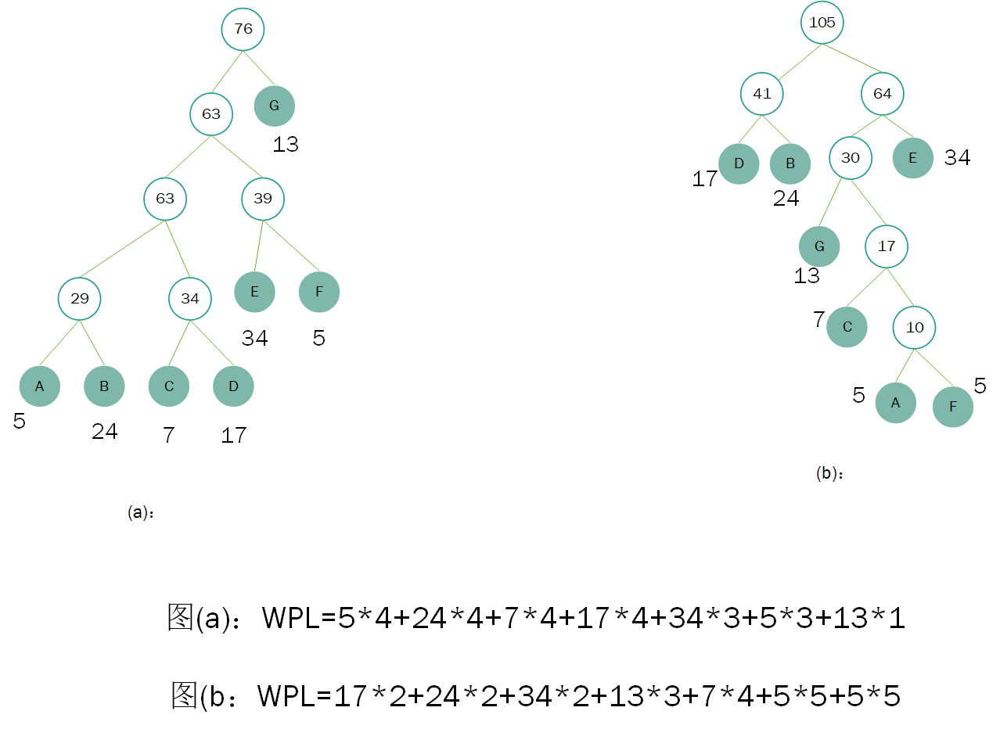
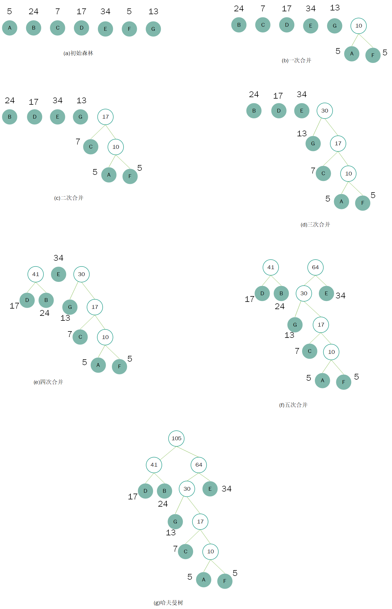
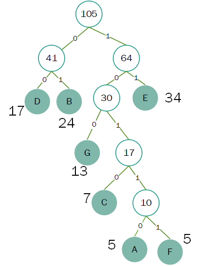
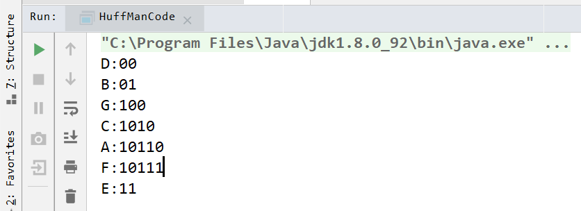

## 一、什么是哈夫曼树

哈夫曼树是一种**带权路径长度最短**的二叉树，也称为**最优二叉树**。

带权路径长度：WPL（Weighted path length）




## 二、如何构建哈夫曼树

- 将所有的节点均作为根节点，构建森林
- 从森林中选取权值最小的两个节点作为一棵新树的左右节点（左节点的权值小于右节点的权值），且置新树的根节点的权值为左右节点的权值之和
- 从森林中删除这两个节点，并把新树移动森林中
- 重复2、3步骤，直到只有一棵树（哈夫曼树）


画图来说明哈夫曼树的构建过程




## 三、哈夫曼编码

树中从根节点到每个叶子节点都有一条路径，对路径上的个分支约定左子树的分支表示`0`,右子树的分支表示`1`，取每条路径上的`01序列`作为各叶子节点对应的字符编码，既是哈夫曼编码。




>D:00
>B:01
>G:100
>C:1010
>A:10110
>F:10111
>E:11


## 四、代码实现

```java
package com.alexanderbai.huffmancode;

import java.util.PriorityQueue;

/**
 * @Description Java实现哈夫曼编码
 * @Author AlexanderBai
 * @Data 2019/5/10 9:24
 */
public class HuffManCode {
    private static int[] count = { 5, 24, 7, 17, 34, 5, 13 };
    private static int N = count.length;
    private static char[] chars = { 'A', 'B', 'C', 'D', 'E', 'F', 'G' };
    private static PriorityQueue<Node> priorityQueue = new PriorityQueue<>();

    private static class Node implements Comparable {
        Character c = null;
        double weight;
        Node left;
        Node right;

        /**
         * 重写compareTo()方法，用于指定元素大小的评价规则
         * @param o 用于比较的元素
         * @return 比较结果，分别用数字1、0、-1表示
         */
        @Override
        public int compareTo(Object o) {
            Node n = (Node) o;
            if (this.weight - n.weight > 0) {
                return 1;
            } else if (this.weight - n.weight < 0) {
                return -1;
            } else {
                //如果两个Node的权值相等，将是由其他节点合并而来的节点设置为较小值，先出队列构建霍夫曼树
                if (n.c == null) {
                    return 1;
                } else if (this.c == null) {
                    return -1;
                } else {
                    return 0;
                }
            }
        }

        public Node(char c, double weight, Node left, Node right) {
            super();
            this.c = c;
            this.weight = weight;
            this.left = left;
            this.right = right;
        }

        public Node(double weight, Node left, Node right) {
            super();
            this.weight = weight;
            this.left = left;
            this.right = right;
        }

        @Override
        public String toString() {
            return "Node [c=" + c + ", weight=" + weight + "]";
        }

    }

    /**
     * 创建哈曼树，PriorityQueue实现了具体的哈夫曼构建规则
     * @return 哈夫曼的根节点
     */
    public static Node create() {
        for (int i = 0; i < N; i++) {
            priorityQueue.add(new Node(chars[i], count[i], null, null));
        }
        while (priorityQueue.size() > 1) {
            Node left = priorityQueue.poll();
            Node right = priorityQueue.poll();

            Node newNode = new Node(left.weight + right.weight, left, right);
            priorityQueue.add(newNode);
        }
        return priorityQueue.poll();
    }

    /**
     * 通过递归调打印哈夫曼树
     * @param node 根节点
     * @param builder 用于保存节点对应的哈夫曼编码序列
     */
    public static void print(Node node, StringBuilder builder) {
        if (node.left == null && node.right == null) {
            System.out.println(node.c + ":" + builder);

        } else {
            print(node.left, builder.append('0'));
            builder.deleteCharAt(builder.length() - 1);
            print(node.right, builder.append('1'));
            builder.deleteCharAt(builder.length() - 1);
        }
    }

    public static void main(String[] args) {
        Node root = create();
        print(root, new StringBuilder());
    }
}
```

- 